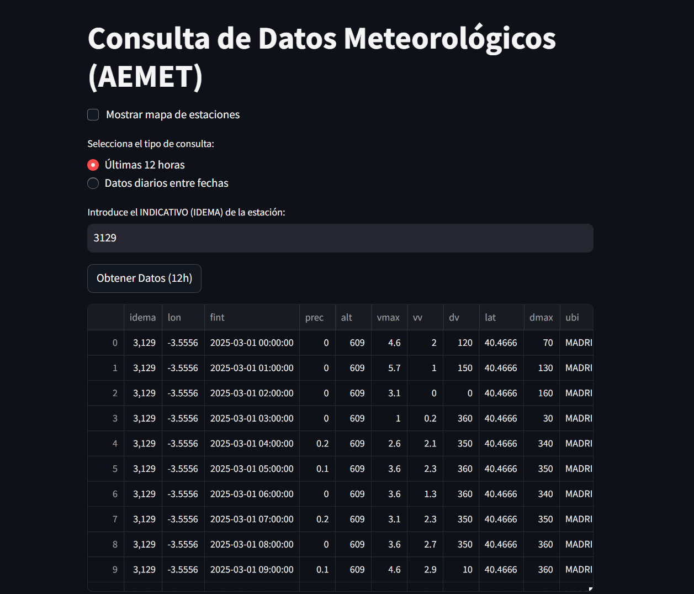
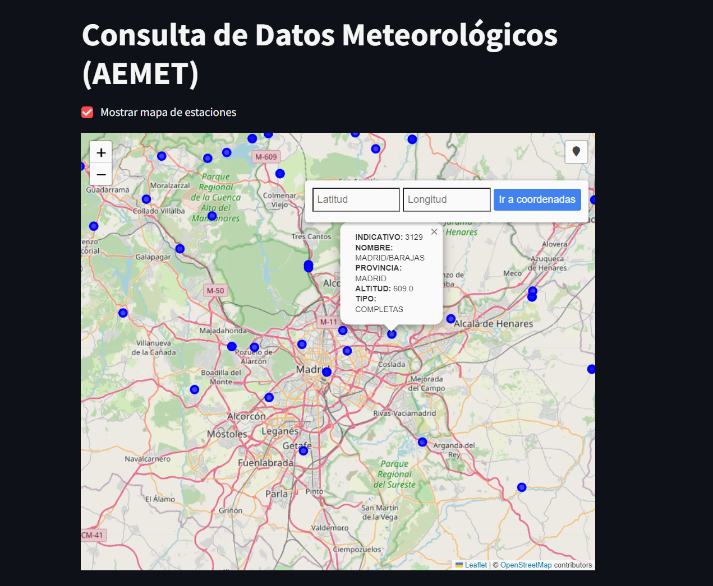
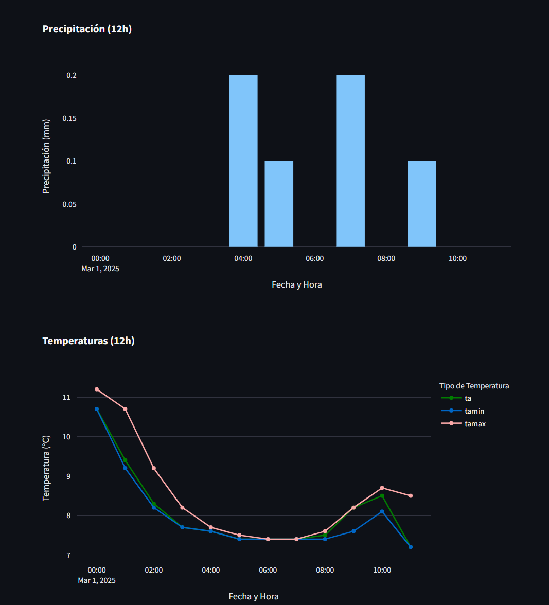

# Extractor de Datos Meteorológicos de AEMET

[](https://www.gnu.org/licenses/gpl-3.0)

Este proyecto es una aplicación Streamlit que permite consultar y visualizar datos meteorológicos de la Agencia Estatal de Meteorología (AEMET) de España, a través de su API pública de datos abiertos. Permite obtener datos de las últimas 12 horas de una estación meteorológica específica, así como datos diarios para un rango de fechas arbitrario.

## Características

*   **Consulta de datos de las últimas 12 horas:** Obtiene los datos más recientes de una estación meteorológica.
*   **Consulta de datos diarios:** Permite seleccionar un rango de fechas y obtener los datos diarios de una estación para ese período.
*   **Visualización interactiva:** Utiliza Plotly para generar gráficos interactivos de precipitación y temperatura.
*   **Descarga de datos:** Permite descargar los datos obtenidos en formato CSV.
*   **Mapa de estaciones:** Incluye un mapa interactivo (iframe) para visualizar la ubicación de las estaciones meteorológicas de AEMET (requiere el archivo `mapa_estaciones.html`).
*   **Manejo de errores:** Incorpora un manejo robusto de errores de conexión y de datos.

## Galería

<table>
  <tr>
    <td></td>
    <td></td>
    <td></td>
  </tr>
</table>

## Requisitos

*   Python 3.7+
*   Las bibliotecas Python listadas en `requirements.txt` (Streamlit, requests, pandas, plotly).
*   Una clave API válida de AEMET OpenData. Puedes obtener una en [https://opendata.aemet.es/](https://opendata.aemet.es/).
*   El archivo `mapa_estaciones.html`, que debe estar en el mismo directorio que `aemet_app.py` (si quieres usar la funcionalidad de mostrar el mapa).

## Instalación

1.  **Clona este repositorio:**

    ```bash
    git clone [https://github.com/Deode22/extractor_aemet.git](https://github.com/Deode22/extractor_aemet.git)
    cd extractor_aemet
    ```

2.  **Crea un entorno virtual (recomendado):**

    ```bash
    python -m venv .venv
    ```

3.  **Activa el entorno virtual:**

    *   **Windows (PowerShell):**
        ```powershell
        .venv\Scripts\Activate.ps1
        ```
    *   **Windows (Símbolo del sistema):**
        ```bash
        .venv\Scripts\activate.bat
        ```
    *   **Linux/macOS:**
        ```bash
        source .venv/bin/activate
        ```

4.  **Instala las dependencias:**

    ```bash
    pip install -r requirements.txt
    ```

5.  **Guarda tu clave API:**

*Abre el script de la aplicacion aemet_app.py y escribe tu clave de la API de AEMET en el lugar donde se indica*

## Uso

1.  **Activa el entorno virtual (si aún no lo has hecho):**
    Ver paso 3 de la instalación.

2.  **Ejecuta la aplicación:**
    ```bash
     streamlit run aemet_app.py
    ```
    Esto abrirá la aplicación en tu navegador web predeterminado.

3.  **Interactúa con la aplicación:**
    *   Selecciona el tipo de consulta (últimas 12 horas o datos diarios).
    *   Introduce el identificador (IDEMA) de la estación meteorológica.
    *   Si estás consultando datos diarios, selecciona las fechas de inicio y fin.
    *   Haz clic en el botón "Obtener Datos".
    *   Los datos se mostrarán en una tabla.
    *   Puedes descargar los datos en formato CSV.
    *   Haz clic en el botón "Graficar" para visualizar los datos.

## Estructura del proyecto

```

extractor\_aemet/
├── .venv          \<- Entorno virtual (no se sube a GitHub)
├── aemet_app.py   \<- Script principal de la aplicación Streamlit.
├── mapa_estaciones.html \<- Archivo HTML con el mapa de estaciones (opcional).
├── requirements.txt  \<- Lista de dependencias del proyecto.
└── README.md      \<- Este archivo.

```

## Contribuciones

Las contribuciones son bienvenidas. Si encuentras un error, tienes una sugerencia o quieres añadir una nueva funcionalidad, por favor, abre un issue o crea un pull request.

## Licencia

Este proyecto está bajo la Licencia GNU GPL v3 - ver el archivo [LICENSE](LICENSE) para más detalles.
